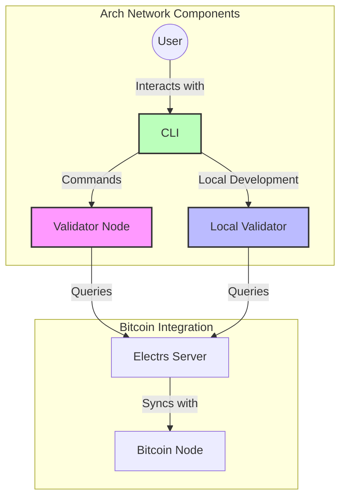
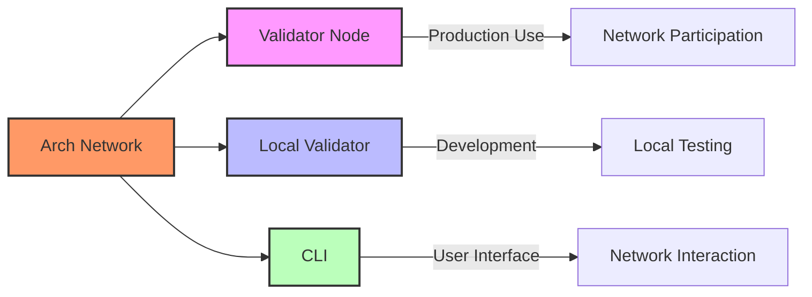
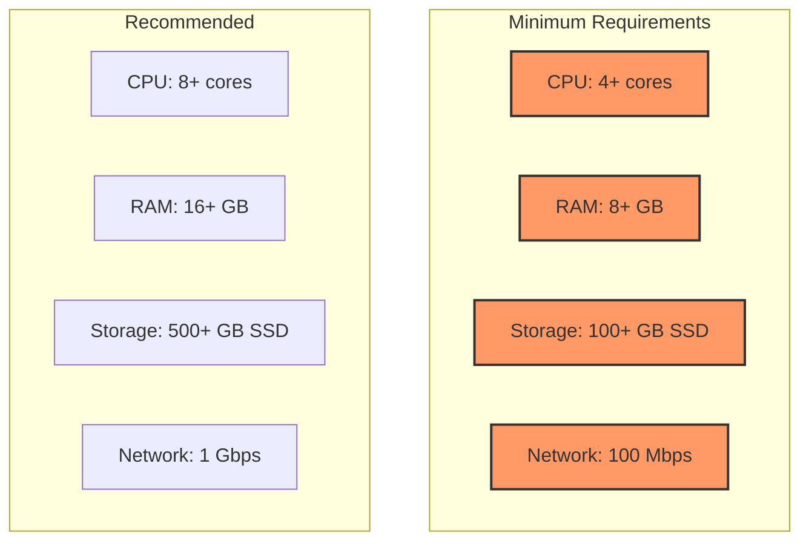
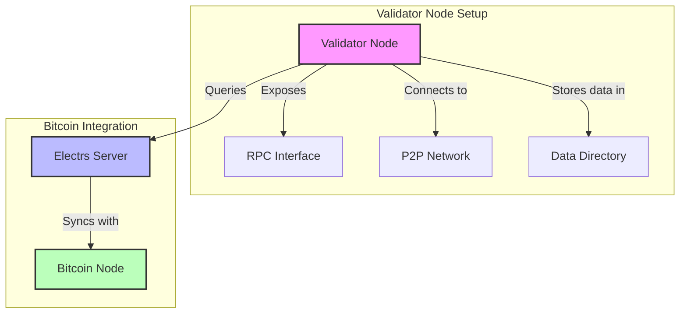
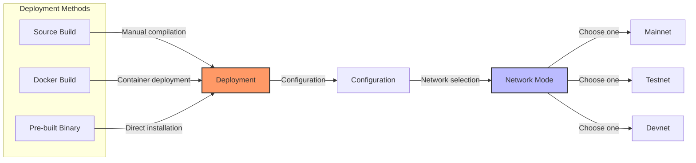

# Arch Network Node Installation Guide

## Architecture Overview



## Available Binaries

Arch Network provides three different binaries for different use cases:



1. **Validator Node** (`validator`)
   - Full validator node for participating in the network
   - Supports mainnet deployment
   - Complete consensus participation

2. **Local Validator** (`local_validator`)
   - Simplified validator for local development
   - Perfect for testing and development
   - Faster setup and iteration

3. **CLI** (`cli`)
   - Command line interface for interacting with the network
   - User-friendly commands
   - Network management capabilities

## System Requirements



## Pre-built Binaries

Pre-compiled binaries are available for the following platforms:

| Platform | Architecture | OS | Download Link |
|----------|--------------|-------|---------------|
| MacOS ARM64 | aarch64 | darwin | [Download](https://github.com/Arch-Network/arch-node/releases) |
| Linux ARM64 | aarch64 | linux-gnu | [Download](https://github.com/Arch-Network/arch-node/releases) |
| MacOS x86_64 | x86_64 | darwin | [Download](https://github.com/Arch-Network/arch-node/releases) |
| Linux x86_64 | x86_64 | linux-gnu | [Download](https://github.com/Arch-Network/arch-node/releases) |

Download the appropriate binary for your platform from the [releases page](https://github.com/Arch-Network/arch-node/releases).

## Building from Source

### Prerequisites

- [Rust](https://www.rust-lang.org/tools/install)
- make
- clang/llvm
- libssl-dev/openssl-dev
- pkg-config
- RocksDB dependencies

#### Ubuntu/Debian

```
bash
curl --proto '=https' --tlsv1.2 -sSf https://sh.rustup.rs | sh
sudo apt-get update
sudo apt-get install make clang libssl-dev pkg-config
```

#### macOS

Install Homebrew if not already installed
```
/bin/bash -c "$(curl -fsSL https://raw.githubusercontent.com/Homebrew/install/HEAD/install.sh)"
```

Install Rust

```
curl --proto '=https' --tlsv1.2 -sSf https://sh.rustup.rs | sh
```

Install other dependencies

```
brew install make llvm openssl pkg-config
```

### Building with Earthly (Recommended)

1. Install [Earthly](https://earthly.dev/get-earthly)
2. Build all binaries:

```
earthly +local
```

The built binaries will be available at:
- `./bin/$ARCH/validator`
- `./bin/$ARCH/local_validator`
- `./bin/$ARCH/cli`

### Building with Cargo

```
bash
cargo build --release
```

The built binaries will be in `./target/release/`.

## Running a Validator Node

The validator node is used for participating in the Arch Network. Configuration options:

```
validator \
--network-mode <MODE> \
--data-dir <DIR> \
--rpc-bind-ip <IP> \
--rpc-bind-port <PORT> \
--boot-node-endpoint <ENDPOINT> \
--p2p-bind-port <PORT> \
--electrs-endpoint <ELECTRS_URL>
```

### Network Modes
- `mainnet`

## Bitcoin Integration

### Electrs Configuration
Both validator types require an Electrs server for Bitcoin integration:

#### Validator Node
- `--electrs-endpoint`: HTTP endpoint for Electrs server (default: http://127.0.0.1:3002)

#### Local Validator
- `--electrs-endpoint`: HTTP endpoint for Electrs server (default: http://127.0.0.1:3002)
- `--electrum-endpoint`: TCP endpoint for Electrum protocol (default: tcp://127.0.0.1:60401)

### Setting up Electrs
Before running any validator, ensure you have Electrs running and properly configured for your network mode:

1. For mainnet: Configure Electrs with Bitcoin mainnet
2. For testnet: Configure Electrs with Bitcoin testnet
3. For devnet/localnet: Configure Electrs with Bitcoin regtest

For installation and configuration of Electrs, refer to the [Electrs documentation](https://github.com/romanz/electrs).

## Docker Compose Example

```
services:
  validator:
    image: ghcr.io/arch-network/validator:latest
    ports:
      - "9001:9001"
    volumes:
      - ./data:/data
    environment:
      - NETWORK_MODE=localnet
      - RPC_BIND_IP=0.0.0.0
      - RPC_BIND_PORT=9001
      - ELECTRS_ENDPOINT=http://electrs:3002
```

## Network Architecture



## Deployment Options


